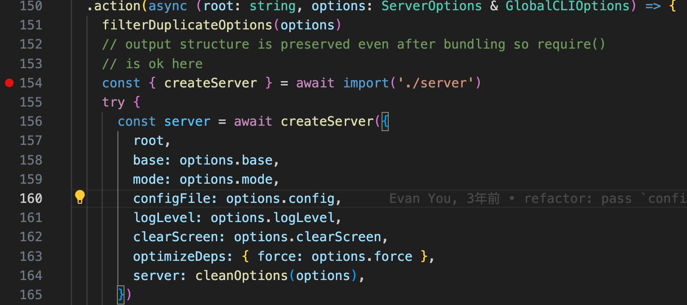
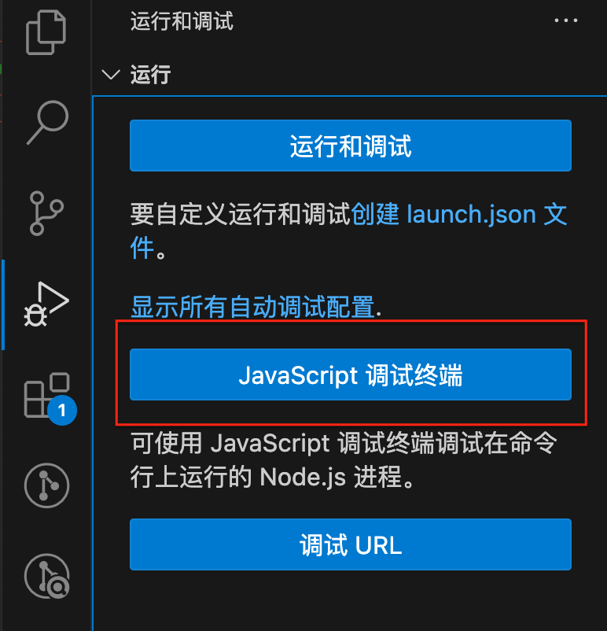
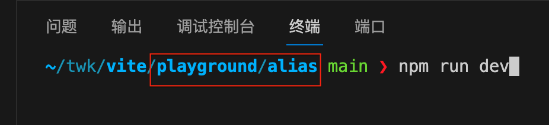

## 准备工作
1. 先fork项目, 再clone到本地
2. 进入项目文件夹中, 执行 `npm run dev` 生成相关sourcemap

## debugger
1. 在入口文件设置debugger点
- packages/vite/bin/vite.js  // vite入口
- packages/vite/src/node/cli.ts // server入口

2. 按如下步骤启动项目
- 点击“js调试终端”生成一个新的控制台终端

- 进入“playground”中某个项目, 执行 `npm run dev`

3. 进程进入debugger点